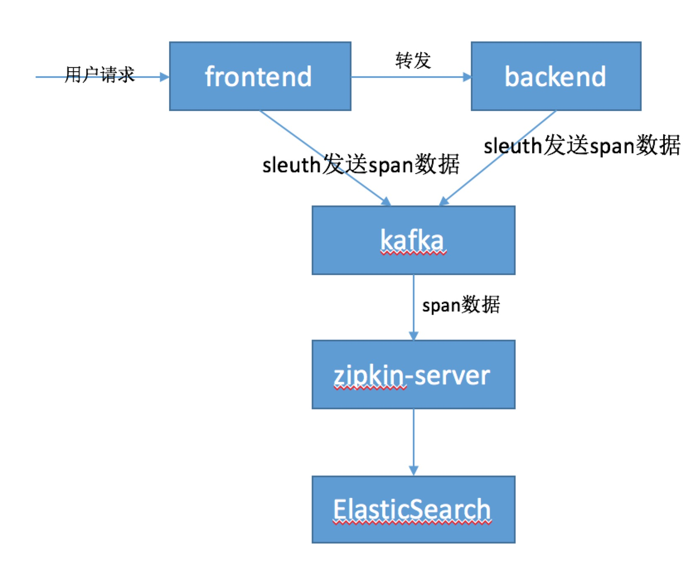

# zipkin-demo
A demo about how to use Spring Cloud Sleuth + Kafka + Zipkin + ElasticSearch

### 模块介绍
* frontend
提供rest接口，处理用户请求，然后转发给backend处理。

* backend
提供rest接口，处理fontend的请求。


* zipkin-server
zipkin的server端，从kafka中接收slueth发送的trace数据，并存储到ES中。  
还提供web ui。

### 系统框架图



### 启动
1、启动zookeeper和kafka  
2、启动ElasticSearch  
3、启动logstash  
```
bin/logstash -f config/logback-test.config
``` 
3、编辑frontend模块的application.yaml，配置kafka地址，并启动App1类   
4、编辑backend模块的application.yaml，配置kafka地址，并启动App2类  
5、编辑zipkin-server模块的application.yaml，配置kafka和ES地址，启动ZipkinApplication类  


### 链路追踪
采用Sleuth和Zipkin，通过Kafka传递数据，数据存储在ES中。  
pom.xml中引入
```
<dependency>
    <groupId>org.springframework.cloud</groupId>
    <artifactId>spring-cloud-starter-zipkin</artifactId>
</dependency>
```
然后在业务模块的application.yaml中配置spring.zipkin.base-url和spring.kafka.bootstrap-servers。

zipin-server项目的application.yaml配置kafka和ES。

向frontend发请求：
```
curl 'http://localhost:8888/'
```

然后浏览器中打开：
```
http://localhost:9411/zipkin/
```
看zipkin web ui。


查看kafka的topic：
```
bin/kafka-console-consumer.sh --bootstrap-server localhost:9092 --topic zipkin
```

查看ES中的trace数据：
```
curl http://localhost:9200/zipkin:span-2018-05-29/_search
```


### 熔断
采用hystrix实现。
backend模块的pom.xml中引入
```
<dependency>
    <groupId>org.springframework.cloud</groupId>
    <artifactId>spring-cloud-starter-openfeign</artifactId>
</dependency>
<dependency>
    <groupId>org.springframework.cloud</groupId>
    <artifactId>spring-cloud-starter-netflix-hystrix</artifactId>
</dependency>

```
通过@FeignClient的fallback属性指定请求失败后的执行方法。

关闭backend程序，继续请求frontend，可以看到frontend正常响应，并且自动执行fallback指定的方法，表明断路器开启了。  
再打开backend程序，继续请求frontend，可以看到frontend正常调用backend，表明断路器关闭了。


### 日志收集
采用ELK实现。

logback.xml中配置:
```
<appender name="LOGSTASH" class="net.logstash.logback.appender.LogstashTcpSocketAppender">
    <destination>127.0.0.1:9250</destination>
    <encoder charset="UTF-8" class="net.logstash.logback.encoder.LogstashEncoder" />
</appender>
```


在ES中查看index为zipkin-demo-%{+YYYYMMdd}的日志：
```
curl http://localhost:9200/zipkin-demo-20180529/_search
```